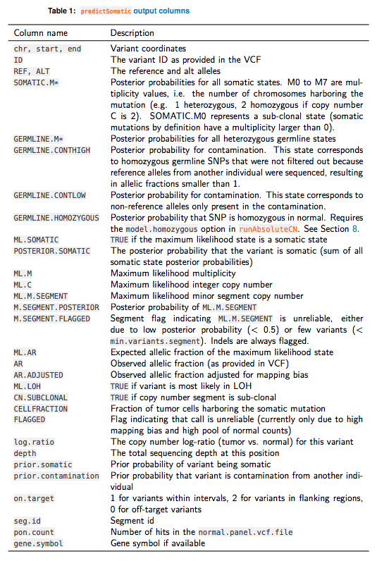
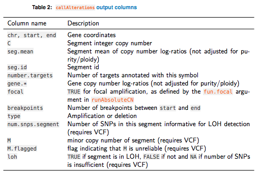
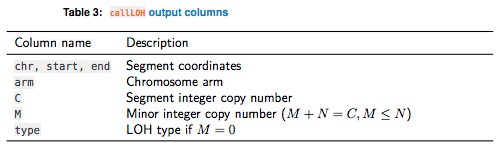
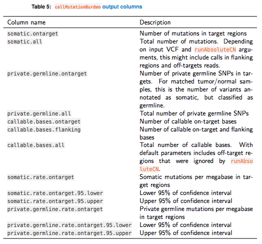

```{r setup, include=FALSE}
knitr::opts_chunk$set(echo = TRUE)
```

```{r echo=FALSE, eval=FALSE}
if (!requireNamespace("BiocManager", quietly = TRUE))
    install.packages("BiocManager")

BiocManager::install("PureCN")
```

# Load the example output
```{r message=FALSE, warning=FALSE}
library(PureCN)
```

```{r}
load(system.file("data/purecn.example.output.rda", package = "PureCN"))
ret = purecn.example.output
```

# Data structures

The R data file (`file.rds`) contains gene-level copy number calls, SNV status and LOH calls. The purity/ploidy combinations are sorted by likelihood and stored in `ret$results`.

```{r data_structure}
names(ret)
```

***
## Prediction of somatic status and cellular fraction
To understand allelic fractions of particular SNVs, we must know the (i) somatic status, the (ii) tumor purity, the (iii) local copy number, as well as the (iv) number of chromosomes harboring the mutations or SNPs. One of PureCN main functions is to find the most likely combination of these four values. We further assign posterior probabilities to all possible combinations or states. Availability of matched normals reduces the search space by already providing somatic status.

The predictSomatic function provides access to these probabilities. For predicted somatic mutations, this function also provides cellular fraction estimates, i.e. the fraction of tumor cells with mutation. Fractions significantly below 1 indicate sub-clonality

```{r}
head(predictSomatic(ret), 3)
```

```{r predictSomatic, echo = FALSE, out.width="\\maxwidth"}

```

***
## Amplifications and deletions

```{r}
gene.calls <- callAlterations(ret)
head(gene.calls)
```

```{r callAlterations, echo = FALSE, out.width="\\maxwidth"}

```

***
## Find genomic regions in LOH
The `gene.calls` data.frame described above provides gene-level LOH information. To find the corresponding genomic regions in LOH, we can use the `callLOH` function:

```{r}
loh <- callLOH(ret)
head(loh)
```

```{r callLOH, echo = FALSE, out.width="\\maxwidth"}

```

***
## Mutation burden
The `predictSomatic` function can be used to efficiently remove private germline mutations. This in turn allows the calculation of mutation burden for un-matched tumor samples. A wrapper function for this specific task is included as `callMutationBurden`:

```{r}
callableBed <- import(system.file("extdata", "example_callable.bed.gz",
    package = "PureCN"))
```

```{r}
callMutationBurden(ret, callable=callableBed)
```

```{r callMutationBurden, echo = FALSE, out.width="\\maxwidth"}

```

# Plot
## Overview
This plot shows the purity and ploidy local optima, sorted by final likelihood score after fitting both copy number and allelic fractions.

```{r overview, fig.height=5, fig.width=5}
plotAbs(ret, type = "overview")
```
The colors visualize the copy number fitting score from low (blue) to high (red). The numbers indicate the ranks of the local optima.

***
## Log-ratio histogram
This figure displays a histogram of tumor vs. normal copy number log-ratios for the maximum likelihood solution (number 1 in Overview). The height of a bar in this plot is proportional to the fraction of the genome falling into the particular log-ratio copy number range. The vertical dotted lines and numbers visualize the, for the given purity/ploidy combination, expected log-ratios for all integer copy numbers from 0 to 7. 

```{r log_ratio_hist, fig.height=5, fig.width=5}
plotAbs(ret, 1, type = "hist")
```

***
## B-Allele frequency plot
This figure shows the allelic fractions of predicted germline SNPs. The goodness of fit (GoF) is provided on an arbitrary scale in which 100% corresponds to a perfect fit and 0% to the worst possible fit. The latter is defined as a fit in which allelic fractions on average differ by 0.2 from their expected fractions. Note that this does not take purity into account and low purity samples are expected to have a better fit. In the middle panel, the corresponding copy number log-ratios are shown. The lower panel displays the calculated integer copy numbers, corrected for purity and ploidy. We can zoom into particular chromosomes using `chr` argument.

```{r BAF_plot, fig.height=8, fig.width=6}
plotAbs(ret, 1, type="BAF")
```
